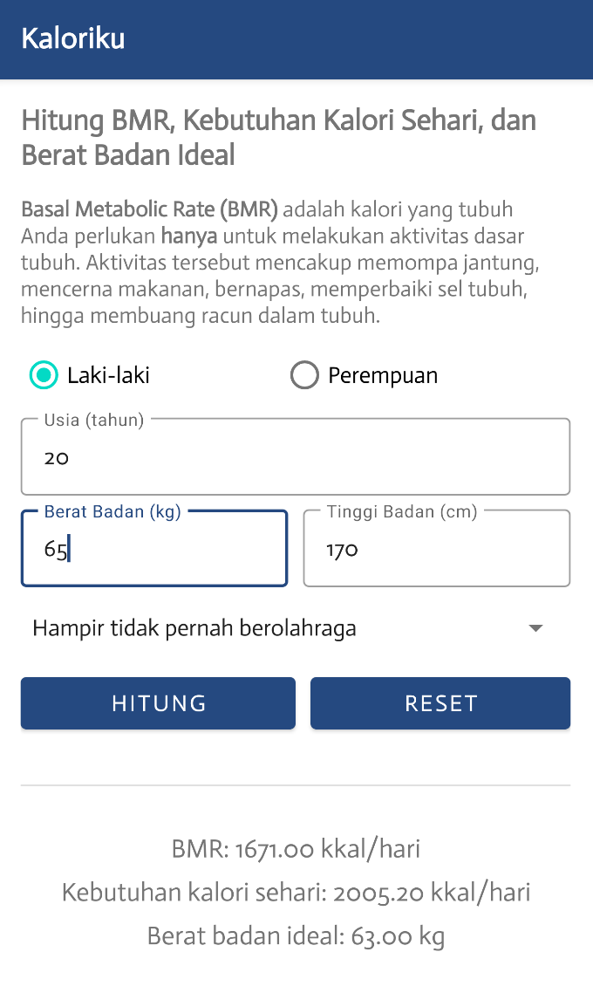

# Kaloriku

Aplikasi Android bernama “Kaloriku” adalah aplikasi yang berguna untuk menghitung tiga hal, di antaranya yaitu BMR (Basal Metabolic Rate), kebutuhan kalori sehari, dan berat badan ideal manusia sesuai data-data yang diinputkan oleh user. User menginputkan data-data yang dibutuhkan dalam perhitungan tiga hal tadi, yaitu jenis kelamin, umur, berat badan, tinggi badan, dan tipe aktivitas sehari-hari user. Jadi dalam aplikasi ini dilakukan tiga macam perhitungan. Dengan aplikasi “Kaloriku” ini diharapkan dapat membantu orang-orang yang sedang ingin melakukan pola hidup lebih sehat serta ingin mengontrol/mengetahui kalori harian dan berat badan yang ideal.

## Lisensi

    Copyright (c) 2022 Ardian Adam Alfarisyi. All rights reserved.

    Dibuat untuk kebutuhan mata kuliah Pemrograman untuk Perangkat Bergerak 1.
    Dilarang melakukan penggandaan dan atau komersialisasi,
    sebagian atau seluruh bagian, baik cetak maupun elektronik
    terhadap project ini tanpa izin pemilik hak cipta.